<!-- # Project Proposal

## Team Members
Vishnuram Ayyavu Vijayakumar

Hilton Paul Tony Raj

Vijay Krishna Sundaran Saravanan


**Algorithmic Trading Strategy for Options and Stock Data**

## Goal:
We aim to predict profitable trading opportunities by combining stock price movements and options market signals such as implied volatility and trends. The goal is to design an algorithmic trading strategy that makes dynamic buy, sell, or hedge decisions. Success is measured by achieving higher risk-adjusted returns (e.g., Sharpe ratio) than a simple buy-and-hold strategy.


## Data Collection process plan
We can collect historical stock price data (**OHLCV**) from free sources like Yahoo Finance (`yfinance` library in Python) or Alpha Vantage (free API for stocks). For options, only current option chain snapshots (strikes, expiry, IV, open interest, volume) are freely available from Yahoo Finance. These datasets can be aligned by timestamp so that options market signals from day *t* can be used to predict stock movements and trading opportunities on day *t+1*. Finally, the combined dataset is cleaned, adjusted for splits/dividends, and structured for modeling.


## Modeling Approach

The algorithmic trading system will combine **predictive modeling** and **classical financial theory** to generate trading signals. Historical stock and options data will be preprocessed and enriched with technical and options-based features. **Neural networks** (Deep architectures, LSTMs, Transformers) will predict future prices and volatility, while classical models such as **Black–Scholes** will provide theoretical prices and implied volatility benchmarks. Trading signals will be derived from the predicted price movements, adjusted for thresholds and risk limits, and executed through **paper trading**.

## Visualizing the data

For multivariate time series, heatmaps, lag plots and scatter matrix plots can be efficient to observe the change of stock prices over time. To visualize forecasting, we plan to use line plots and cumulative return curves and analyze the performance.

## Test Plan

The algorithm will be evaluated via **paper trading** using the **Alpaca API**. After training on historical stock and options data, it will execute trades in a simulated live market environment, allowing performance assessment (**profit/loss, Sharpe ratio, drawdown**) without risking real capital. -->


## Video Presentation - https://youtu.be/G3ffEuLAHD4


# 1. AI-Powered Sentiment Trading Bot (LumiBot + Ollama)

## 1. Project Overview
This project implements an algorithmic trading strategy that fuses traditional technical backtesting with Generative AI. It uses **LumiBot** for the trading framework and **Ollama (running Llama 3)** to perform Natural Language Processing (NLP) on financial news.

The bot scrapes news headlines, analyzes them for market sentiment (Positive/Negative) and confidence (0.0 to 1.0), and executes Buy/Sell orders based on these AI-driven signals.

## 2. Key Features
* **Hybrid Architecture:** Combines deterministic trading logic with probabilistic LLM reasoning.
* **Local LLM Inference:** Uses `Ollama` to run Llama 3 locally, ensuring privacy and zero API costs for the LLM.
* **Live Web Search:** Utilizes `DuckDuckGo` via LangChain to fetch real-time or date-specific market news.
* **Structured Output:** Enforces strict JSON output from the LLM using Pydantic models (`BaseModel`), preventing parsing errors.
* **Backtesting Engine:** Simulates performance using historical data via Yahoo Finance.

## 3. Dependencies & Prerequisites
To run this code, you need the following Python libraries and a running instance of Ollama.

### Python Libraries
```bash
pip install lumibot ollama langchain-community duckduckgo-search colorama pydantic
```

### System Requirements

* Ollama: Must be installed and running.

* Model: You must pull the Llama 3 model before running the script:

```
ollama pull llama3
```


## 4. Code Architecture & Breakdown

The code provided includes two variations: one for Stocks (SPY) and one for Crypto (BTC). Both share the same logic flow but use different market parameters.
### A. Data Gathering (News)

The bot uses the DuckDuckGoSearchAPIWrapper to find financial news.

* Function: get_web_deets(start_date, end_date)
* Process: It constructs a query (e.g., "S&P 500 market news sentiment [Date]" or "bitcoin crypto market news...") to fetch relevant headlines for the specific trading day being analyzed.

### B. The AI Brain (Sentiment Analysis)

This is the core differentiator of the strategy.

* Prompt Engineering: The prompt_template function instructs the LLM to act as a financial analyst. It demands a specific JSON format containing a sentiment and a score.

* Structured Response: The Response(BaseModel) class defines the expected data structure: { sentiment: String, score:Float }
* Inference: The chat function sends the news to Llama 3. The temperature is set to 0 to ensure the model isdeterministic and factual, rather than creative.

### C. The Trading Strategy (LumiBot)

The logic is encapsulated in the StockTrader (or CryptoTrader) class, inheriting from Strategy.
#### 1. Initialization (initialize)

Sets up the environment.

* Stocks: Sets market to "NYSE" (trading hours 9:30 AM - 4:00 PM ET).* 
* Crypto: Sets market to "24/7" (non-stop trading).* 
* Cash at Risk: Defines what percentage of the portfolio is used per trade (e.g., 50% for stocks, 20% for crypto).

#### 2. Position Sizing (position_sizing)

Calculates how many shares/coins to buy based on available cash and current price. $$ Quantity = \frac{Cash \times RiskFactor}{CurrentPrice} $$
#### 3. Execution Logic (on_trading_iteration)

This method runs on every iteration (daily in this config).

* Check Data: Gets the current price and cash.
* Get Signal: Calls get_sentiment() to analyze the news.
* Decision Matrix:

    * BUY Signal: If Sentiment == "positive" AND Score >= 0.7.    
    * SELL Signal: If Sentiment == "negative" AND Score >= 0.7.   
    * Neutral: If the score is below 0.7, no action is taken (holds position).

#### D. Backtesting (__main__)

The script uses YahooDataBacktesting.

* It downloads historical price data for the specified timeframe (e.g., 2023-2024).
* It runs the strategy over this historical data to simulate how the bot would have performed.

<!-- 
## 5. Comparison: Stock vs. Crypto Implementation

The provided code contains two slightly different implementations. Here are the differences:

Feature,Stock Implementation,Crypto Implementation
Asset Class,SPY (S&P 500 ETF),BTC-USD (Bitcoin)
Market Hours,NYSE (9:30 AM - 4:00 PM ET),24/7 (Non-stop)
Search Query,"""S&P 500 market news...""","""bitcoin crypto market news..."""
Risk Profile,cash_at_risk: 0.5 (Aggressive),cash_at_risk: 0.2 (Conservative) -->


## 4.0 Comparative Performance Analysis: Equity vs. Cryptocurrency Models
### 4.1 Executive Summary

This section evaluates the performance of the core trading algorithm applied to two distinct asset classes: Equities (S&P 500/SPY) and Cryptocurrency (Bitcoin/BTC). The data reveals that while the adjusted model has been successfully optimized for the equity market, the same logic significantly underperforms in the cryptocurrency market due to a fundamental misinterpretation of upside volatility.
### 4.2 Equity Strategy Evaluation (StockTrader)

The optimized StockTrader strategy demonstrates high efficiency and strong alignment with the benchmark index.

* Return Profile: The strategy generated an annual return of 21.9%, closely tracking the SPY benchmark.

* Capital Efficiency: Analysis of the cash utilization curves (Teal Line) indicates the model remained fully invested during the majority of the reporting period. Unlike previous iterations, the model avoided "panic selling" during minor market noise, maintaining a cash position near 0% during the primary uptrends of 2023.

* Risk Metrics: The strategy achieved a Sharpe Ratio of 1.18 and a Sortino Ratio of 1.79, indicating a favorable risk-adjusted return profile. The Maximum Drawdown was limited to -9.9%, suggesting the risk management parameters are well-tuned for standard equity market volatility.

#### Equity Strategy Performance Chart

<!--  -->
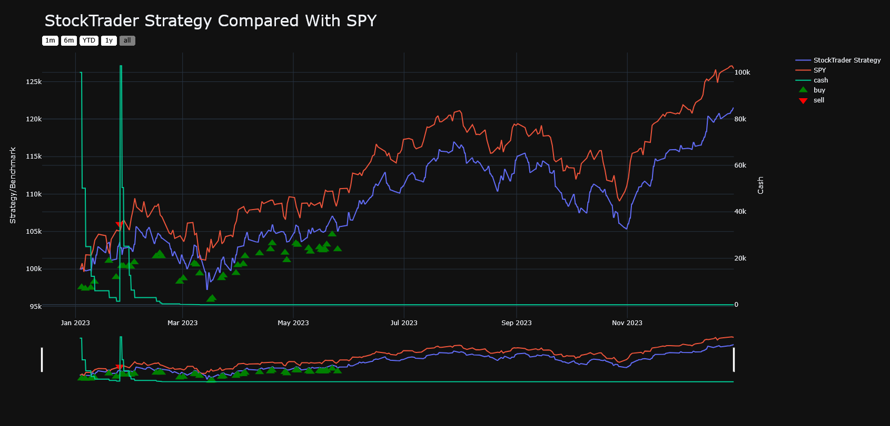
*Figure: Cumulative returns and cash utilization for StockTrader strategy vs SPY benchmark.*

### 4.3 Cryptocurrency Strategy Evaluation (CryptoTrader)

The CryptoTrader strategy, utilizing identical logic, failed to capture the full momentum of the underlying asset.

* Performance Gap: While the strategy achieved a total return of 94.04%, it significantly trailed the BTC-USD benchmark, which exceeded 140% over the same period.

* The "Volatility Trap": Visual analysis of the trading behavior reveals a critical flaw during high-momentum rallies. During the parabolic price increase in November 2024, the algorithm’s cash position spiked to nearly 100%. This indicates the model interpreted the explosive upside volatility as risk, triggering a defensive exit to cash precisely when the asset was most profitable.

* Opportunity Cost: By exiting the market during these high-volatility expansion phases, the strategy suffered from significant opportunity cost, effectively "selling the winners" prematurely.

#### Cryptocurrency Strategy Performance Chart


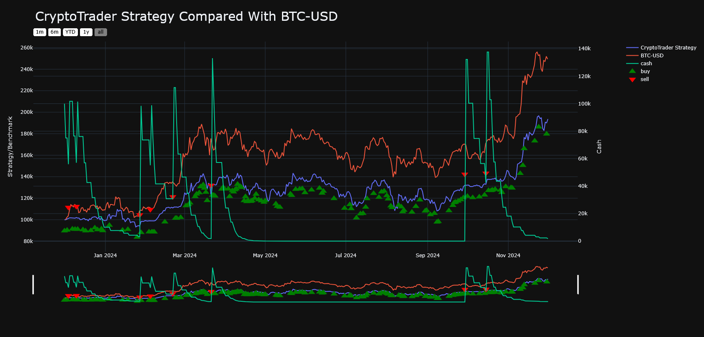
*Figure: BTC returns vs CryptoTrader strategy and cash position during high-volatility periods.*


### 4.4 Technical Conclusion & Recommendations

The divergence in performance highlights that volatility functions differently across asset classes.

* In Equities (SPY): High volatility is often correlated with downside risk (crashes). The model’s defensive logic correctly preserved capital.

* In Crypto (BTC): High volatility is often correlated with upside expansion (rallies). The model’s defensive logic incorrectly identified this as a threat.


# 2. **Historical Stock Data Visualization and Transformer-Based Price Prediction**

## **1. Objective**
We analyze stock market data using various visualization techniques and model historical stock data using a Transformer-based deep learning model. This helps understand trends, volatility, relationships between assets, and predictive performance of modern sequence models on financial data.

---

## **2. Data Overview**

**Dataset Source:** Yahoo Finance  
**Duration:** 2013-01-01 to 2023-01-01  
**Tickers Used:** `AAPL`, `MSFT`, `GOOG`, `AMZN`, `AAME`

The dataset contains **2,518 trading days**, with six columns per stock:
- Open  
- High  
- Low  
- Close  
- Adjusted Close  
- Volume

There were **no missing or duplicate entries**, confirming a clean dataset for visualization and modeling.

---

## **3. Data Visualizations**

For below visualization we choose AAPL historical stock data. 

### **3.1 Line Chart of Closing Prices**

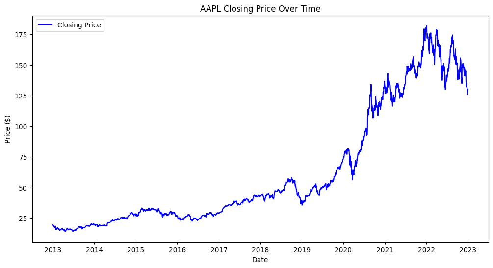


**Purpose:**  
To visualize long-term trends and patterns in Apple’s stock price.

**Description:**  
A line plot of AAPL’s closing price over time shows the steady upward growth of Apple’s stock over the 10-year period, with occasional corrections and short-term volatility.

**Interpretation:**  
The consistent growth reflects Apple’s strong business performance and market dominance. Sudden dips often correspond to broader market events or earnings reports.

---

### **3.2 Moving Averages (50-day and 200-day)**

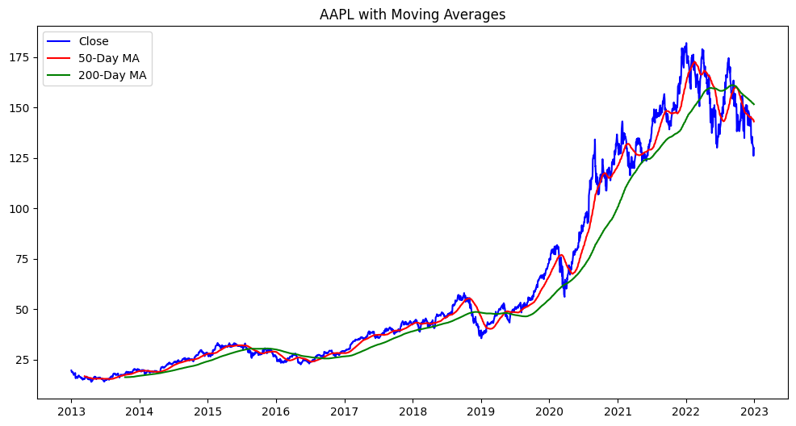

**Purpose:**  
To smooth short-term fluctuations and reveal longer-term trends, common in technical analysis.

**Description:**  
The 50-day (short-term) and 200-day (long-term) moving averages were plotted along with the closing price.  
- When the 50-day MA crosses above the 200-day MA (Golden Cross), it suggests a potential uptrend.  
- When it crosses below (Death Cross), it may indicate a potential downtrend.

**Interpretation:**  
The visualization highlights the momentum and trend reversals in Apple’s stock, helping identify periods of bullish or bearish sentiment.

---

### **3.3 Daily Returns Distribution**

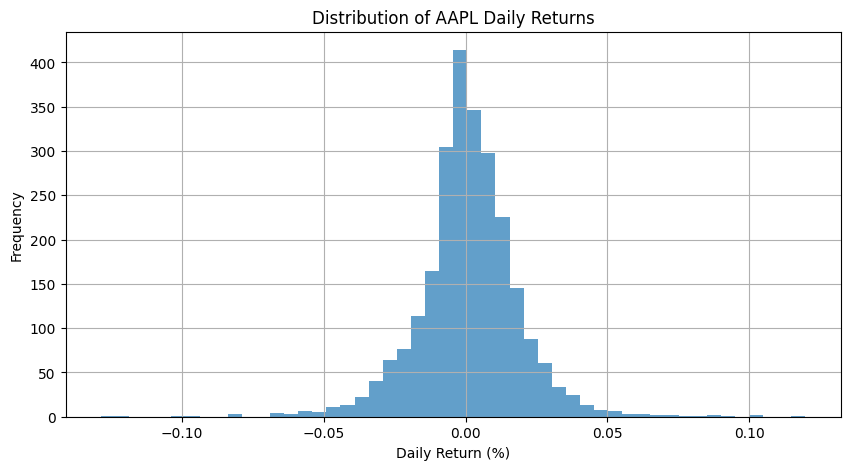
    
**Purpose:**  
To assess volatility and risk by examining how much the stock’s price changes daily.

**Description:**  
A histogram of daily returns shows most returns clustered around zero, with a few large positive or negative outliers.

**Interpretation:**  
The shape indicates that while daily price changes are typically small, occasional large fluctuations occur — typical of financial time series with “fat tails”.

---

### **3.4 Rolling Volatility (30-Day Window)**
    
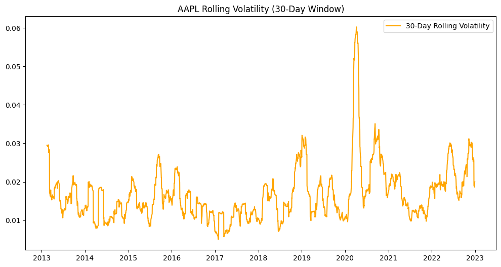

**Purpose:**  
To analyze time-varying volatility over time.

**Description:**  
A rolling standard deviation of daily returns (30-day window) was plotted to visualize changing volatility levels.

**Interpretation:**  
Spikes in rolling volatility correspond to periods of uncertainty — such as market-wide downturns or economic news events. This helps risk managers anticipate turbulent market phases.

---

### **3.5 Correlation Heatmap**

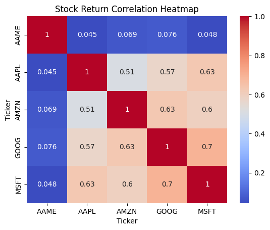
    
**Purpose:**  
To visualize relationships among multiple tech stocks (AAPL, MSFT, GOOG, AMZN, AAME).

**Description:**  
A heatmap was created using Pearson correlation coefficients of percentage changes in closing prices.

**Interpretation:**  
- AAPL, MSFT, GOOG, and AMZN show strong positive correlations (≈0.8–0.9), indicating they tend to move together — typical of tech sector stocks.  
- AAME, a smaller firm, has weaker correlations, implying different market drivers.

---

### **3.6 Multi-Stock Comparison**

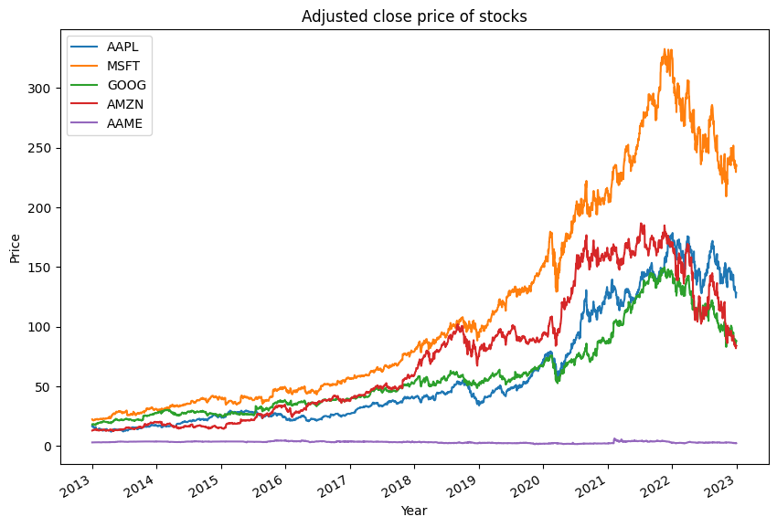

**Purpose:**  
To compare the performance of several stocks over time.

**Description:**  
A line chart plotted the adjusted closing prices for all five tickers from 2013–2023.

**Interpretation:**  
Tech giants (AAPL, MSFT, GOOG, AMZN) exhibited similar growth trajectories, while AAME remained relatively stagnant. This visualizes sector dominance and scale disparities.

---

### **3.7 Normalized Price Comparison**

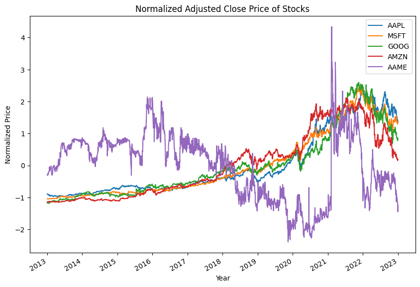


**Purpose:**  
To enable comparison across stocks with different price scales.

**Description:**  
Prices were normalized using z-score normalization:  

$z = \frac{(x - \text{mean})}{\text{std}}$

Normalized plots show how each stock’s relative performance deviates from its mean.

**Interpretation:**  
This allows fairer comparison of trends — e.g., how volatile each stock is relative to itself, not its absolute price.

---


## **4. Understanding the Transformer Architecture for Stock Prediction**

### **4.1 Overview of the Transformer**
The **Transformer** architecture was originally introduced in the paper *"Attention is All You Need"* (Vaswani et al., 2017) for machine translation. Unlike recurrent models such as RNNs or LSTMs, Transformers **do not rely on sequential recurrence**. Instead, they use a mechanism called **self-attention** to model dependencies between elements in a sequence — regardless of their distance apart.

This makes Transformers extremely powerful for **time-series forecasting**, especially when long-range dependencies exist like in the case of stock prices.

---

### **4.2 Key Components**
#### **1. Input Embedding**
Each time step (e.g., a day’s stock features like Open, High, Low, Close, Volume) is projected into a high-dimensional vector space.  
This converts raw numerical data into dense embeddings that capture feature interactions.

#### **2. Positional Encoding**
Because Transformers process all time steps in parallel (not sequentially like RNNs), they lose the concept of “order.”  
To address this, **positional encodings** are added to embeddings to inject information about the position of each day in the sequence (e.g., day 1, day 2, etc.).

Mathematically:

$ PE_{(pos, 2i)} = \sin\left(\frac{pos}{10000^{2i/d_{model}}}\right)$


$PE_{(pos, 2i+1)} = \cos\left(\frac{pos}{10000^{2i/d_{model}}}\right)$

These periodic encodings allow the model to infer temporal relationships.

#### **3. Self-Attention Mechanism**
The heart of the Transformer is **self-attention**, which computes how strongly each time step should attend to every other step.  
This is defined as:

$\text{Attention}(Q, K, V) = \text{softmax}\left(\frac{QK^T}{\sqrt{d_k}}\right)V$


- **Q (Query):** Represents the current time step we’re focusing on  
- **K (Key):** Represents other time steps in the sequence  
- **V (Value):** The information we want to aggregate  

The attention output allows the model to dynamically weigh which previous days are most relevant for predicting the next stock price.

#### **4. Multi-Head Attention**
Instead of one attention mechanism, multiple heads run in parallel, allowing the model to learn different types of temporal and feature relationships simultaneously — e.g., one head might focus on recent volatility, while another tracks long-term growth patterns.

#### **5. Feed-Forward and Normalization Layers**
After attention, a small neural network processes the aggregated information for each time step, followed by **layer normalization** and **residual connections** to stabilize training and avoid vanishing gradients.

#### **6. Output Layer**
Finally, a linear layer maps the Transformer’s hidden representation to a single output — in this case, the predicted normalized **closing price**.

---

### **6.3 Why the Transformer is Suitable for Stock Market Prediction**

| **Reason** | **Explanation** |
|-------------|-----------------|
| **Captures Long-Term Dependencies** | Stock prices often depend on trends spanning weeks or months. Unlike RNNs, Transformers can model relationships across long time horizons efficiently. |
| **Handles Multivariate Inputs** | The model can process multiple correlated features (Open, High, Low, Volume, etc.) and learn how they collectively influence the target. |
| **Parallel Computation** | Self-attention allows simultaneous processing of all time steps, making it faster and more scalable than sequential models like LSTMs. |
| **Flexible Attention Mechanism** | The model can dynamically focus on the most relevant time steps — for instance, ignoring minor fluctuations and attending to significant market shifts. |
| **Generalization Ability** | With enough data, Transformers can generalize across different stocks or regimes, especially when pre-trained on large datasets. |

---

### **6.4 Challenges in Applying Transformers to Stock Markets**
While powerful, Transformers are **not a silver bullet** for financial forecasting:

1. **High Noise & Non-Stationarity:**  
   Financial time series are noisy and regime-dependent. Sudden market events can break learned patterns, making predictions unreliable.

2. **Data Scarcity:**  
   Compared to NLP datasets (millions of samples), stock market data has limited historical observations (~2,500 trading days per decade).

3. **Overfitting Risk:**  
   Transformers are parameter-heavy. Without strong regularization or large datasets, they may overfit to short-term noise.

4. **Causality & Lag:**  
   Transformers capture correlations but not causation. Market movements are influenced by external factors (news, economy) beyond price history.

5. **Interpretability:**  
   Attention weights can offer some interpretability, but the reasoning behind model decisions in volatile markets remains opaque.

---

### **6.5 Summary**
Transformers are a **promising tool** for modeling sequential dependencies and patterns in stock data due to their ability to attend over long historical contexts and handle multivariate inputs. However, success in stock prediction requires:
- Careful feature engineering (technical indicators, sentiment, macro data)
- Adaptive learning strategies
- Regularization and hybrid architectures (e.g., **CNN + Transformer**, **LSTM + Attention**)

When designed thoughtfully, Transformers can serve as the **foundation for advanced financial forecasting systems**, providing insights into market trends rather than merely point predictions.


## **4. Transformer-Based Stock Price Prediction**


### **4.1 Data Preprocessing**
- Used **AAME** stock for modeling.  
- Normalized all columns (`Low`, `Open`, `High`, `Close`, `Volume`, `Adjusted Close`) to zero mean and unit variance for stable training.  

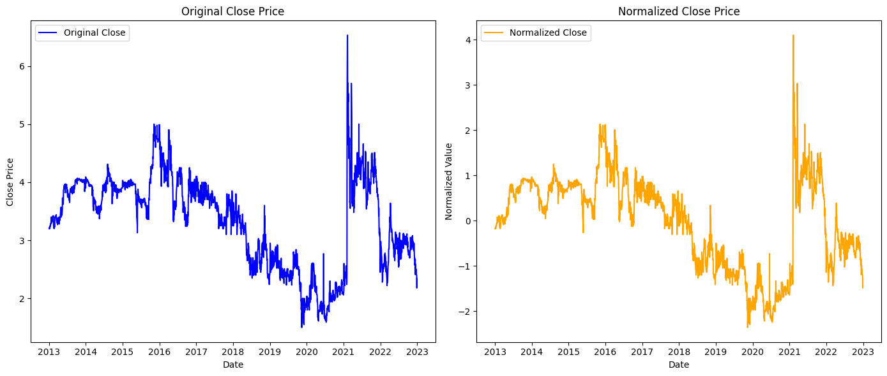

- Split into:
  - Train: 70%  
  - Validation: 15%  
  - Test: 15%  
- Created sequences of 10 time steps for input to the model.

---

### **4.2 Model Architecture**
**Model Type:** Transformer Encoder  
**Components:**
- **Embedding Layer:** Projects input features to a higher-dimensional hidden space.  
- **Transformer Encoder:** Captures temporal dependencies and relationships using self-attention.  
- **Fully Connected Layer:** Outputs the predicted closing price.

**Hyperparameters:**
- Context Window size: 10/30 (Two experiments)
- Hidden size: 64  
- Layers: 2  
- Attention heads: 4  
- Learning rate: 0.001  
- Epochs: 80  
- Loss: Mean Squared Error (MSE)

---

### **4.3 Training and Evaluation**

<!-- The experiment has been performed for two context windows, 10 and 30 

Training and validation losses decreased consistently, showing the model successfully learned patterns from the data without severe overfitting.

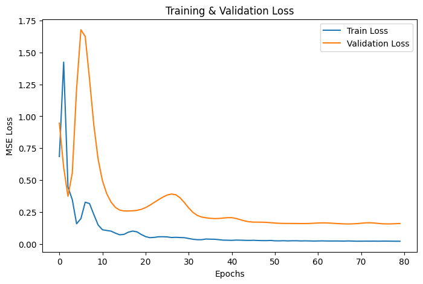

for context windows 10

**Test Set Metrics:**

| Metric | Value |
|:-------|-------:|
| MAE | 0.1275 |
| MSE | 0.0322 |
| RMSE | 0.1795 |
| MAPE | 27.32% |
| Directional Accuracy | 46.74% |


for context windows 30
Test Set Metrics:
MAE:  0.1230
MSE:  0.0265
RMSE: 0.1627
MAPE: 26.5362%
Directional Accuracy: 48.56% -->


### **4.3 Experimental Results with Different Context Windows**

The experiment was performed using **two context window sizes** — 10 and 30 — to analyze how the model’s receptive field (amount of past data it considers) affects predictive performance.

Training and validation losses decreased consistently for both settings, showing that the Transformer successfully learned temporal patterns from the stock data without severe overfitting.

---

#### **Results for Context Window = 10**


**Test Set Metrics:**

| **Metric** | **Value** |
|:------------|----------:|
| **MAE** | 0.1275 |
| **MSE** | 0.0322 |
| **RMSE** | 0.1795 |
| **MAPE** | 27.32% |
| **Directional Accuracy** | 46.74% |

---

#### **Results for Context Window = 30**
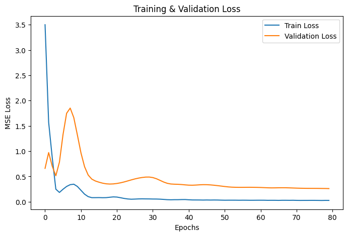

**Test Set Metrics:**

| **Metric** | **Value** |
|:------------|----------:|
| **MAE** | 0.1230 |
| **MSE** | 0.0265 |
| **RMSE** | 0.1627 |
| **MAPE** | 26.54% |
| **Directional Accuracy** | 48.56% |

---

**Analysis**

- Increasing the **context window from 10 to 30** improved all evaluation metrics slightly.  
- The lower **MAE**, **MSE**, and **RMSE** values indicate better predictive accuracy.  
- The improvement in **Directional Accuracy** (from 46.74% → 48.56%) shows that the model became better at predicting the direction of price changes.  
- A longer context window allows the Transformer to leverage **more temporal context**, helping it capture **long-term dependencies and trends** in stock movement.  
- However, the gain is moderate, reflecting the **stochastic and non-stationary nature** of stock prices.


<!-- **Interpretation:**  
The Transformer achieved moderate accuracy. The high MAPE and ~47% directional accuracy indicate limited predictive power—expected given the noise and non-stationarity of stock prices. -->

---

<!-- ### **4.4 Visual Results**
1. **Predicted vs Actual Prices (Normalized):**  
   Shows model predictions closely following actual values in trend but with slight phase lag.

    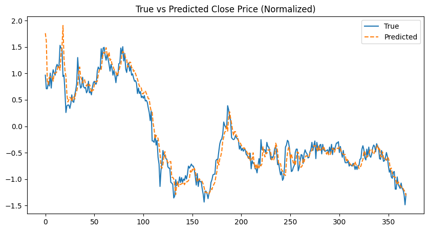


2. **Cumulative Return Curve:**  
   Simulates a simple long-only strategy using predicted directions. The cumulative profit curve indicates that model-driven trading yields only marginal gains, reflecting difficulty in directional forecasting.

   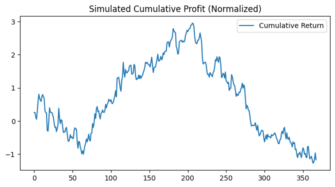 -->

### **4.4 Visual Results**

The Transformer model’s performance was evaluated visually for **two context window sizes** — 10 and 30 — to compare how expanding the historical context affects prediction quality and simulated trading performance.

---

#### **A. Context Window = 10**

1. **Predicted vs Actual Prices (Normalized):**  
   The model’s predictions closely follow the overall trend of the true stock prices, though with slight lag and minor deviations in short-term fluctuations.  
   This indicates the Transformer effectively captures general temporal patterns but struggles with short-term volatility.

   

2. **Cumulative Return Curve:**  
   A simulated **long-only strategy** was applied using the predicted directions.  
   The cumulative return curve shows marginal gains, suggesting the model captures directional movement slightly better than random, but not strongly enough for significant profit.

   

---

#### **B. Context Window = 30**

1. **Predicted vs Actual Prices (Normalized):**  
   With a longer context window, predictions align more closely with the true values, showing smoother and more stable trend tracking.  
   The extended sequence length allows the Transformer to better understand long-term dependencies in stock movement.

   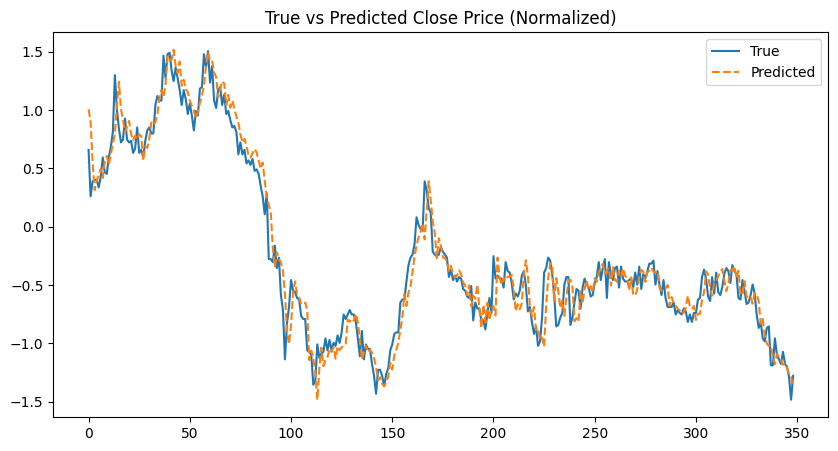

2. **Cumulative Return Curve:**  
   The trading simulation for the 30-day window displays a slightly improved cumulative return.  
   This suggests that incorporating a longer temporal context helps the model identify trend reversals and sustained price movements more effectively.

   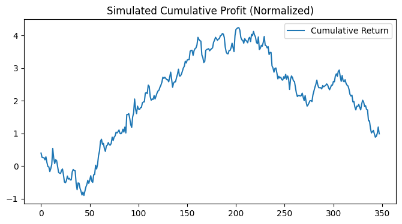

---

### **Analysis**
- **Visual Trend Tracking:** Increasing the context window enhances the model’s ability to align with long-term price trends and reduces noise in predictions.  
- **Trading Simulation:** Both setups produce modest gains, but the 30-day window yields smoother and higher cumulative returns, indicating better directional consistency.  
- **Interpretation:** Stock market prediction remains inherently uncertain, yet these visual results demonstrate that **context length plays a vital role** in how well the Transformer captures temporal dependencies and volatility structures.


---

<!-- ## **5. Insights & Conclusion**
- **Visualization Phase:** Provided strong exploratory understanding of stock dynamics—trend, volatility, and inter-stock relationships.  
- **Modeling Phase:** Demonstrated that while Transformers can learn temporal patterns, pure price-based prediction remains challenging due to market noise and non-stationarity.  
- **Next Steps:**  
  - Incorporate technical indicators (RSI, MACD) and macroeconomic signals.  
  - Use hybrid models combining CNNs + Transformers.  
  - Test adaptive learning rates and attention mechanisms for regime shifts.

--- -->


### **5 Results for AAPL Stock**

**Test Set Metrics:**

| **Metric** | **Value** |
|:------------|----------:|
| **MAE** | 1.6292 |
| **MSE** | 2.7182 |
| **RMSE** | 1.6487 |
| **MAPE** | 86.07% |
| **Directional Accuracy** | 44.57% |

---

#### **Visual Results**

1. **Predicted vs Actual Close Price (Normalized)**  

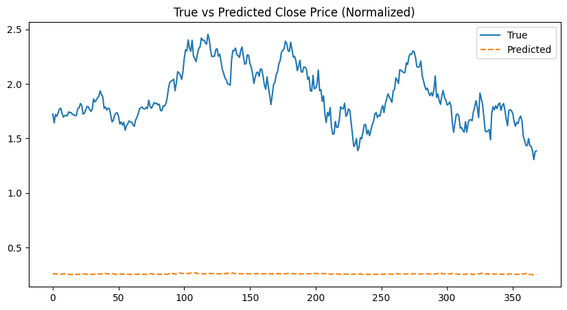

   The predictions remain nearly flat while the true prices fluctuate sharply, indicating that the model failed to capture temporal dynamics.  

   
2. **Simulated Cumulative Profit (Normalized)**  
      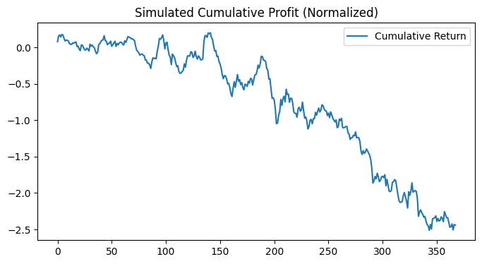

   The cumulative return curve trends downward, showing poor directional forecasting and overall loss in simulated trading.

---

### **Analysis**
The weak performance on AAPL likely stems from:

- **High volatility and external influence:** Price movements depend on news and global events, which pure price data can’t capture.  
- **Limited features:** Only OHLC and Volume data were used, offering little predictive signal.  

In short, while Transformers can model long-term dependencies, they struggle with **highly efficient, noisy markets like AAPL** without richer contextual features or adaptive mechanisms.


# 3. Option Pricing Methods: Black-Scholes and Binomial Model

For options data, we first begin with an analytical approach using two fundamental option pricing methods widely used in quantitative finance: the **Black-Scholes Model** and the **Binomial Options Pricing Model**. These methods are essential for valuing options and understanding the dynamics of financial derivatives. As an initial analysis and observation, we currently only propose these two analytical method solution for Options data and further will shift towards deep neural networks.

---

## Data Processing

For both the analytical methods, we are only using data taken from Yahoo Finance. We have used the 'yfinance' library to extract the data. The stock that we are concerned with is "AAPL" as it has high consistency in option prices across time.

Traditionally, yfinance consists of historical stock pricing data. However, we can exercise a method named 'yf.Ticker' to configure towards options prices and extract it based on a specific exercising date in the future. Currently, yfinance has options data until '2028-01-21'.

The extracted data has the following data fields "contractSymbol", "strike", "bid", "ask", "impliedVolatility", "price", "remaining". The data does not need require much pre-processing. It is cleaned and normalized values. However, to understand this dataset, we had to conduct exploratory data analysis. We have plotted basic information about the data for a short period of time and observed trends.

A common visualization that is conducted to understand options data is "Implied volatility vs Strike price". This is done to observe the variations in the implied volatility when compared to the strike price, plotted over specific dates. 


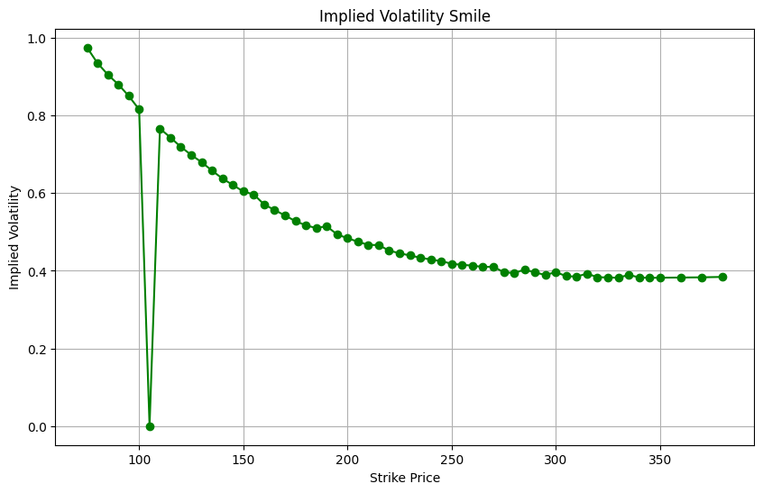

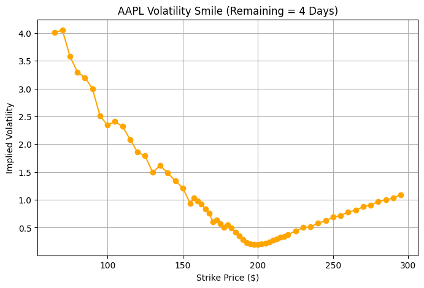


## 1. Black-Scholes Model

### Overview

The Black-Scholes model is a mathematical model used for pricing European-style options. Primarily there are two types of Options, European option (which can only be exercised at date of maturity) and American option (which can be exercised anytime before or on the date of maturity). It provides a closed-form analytical formula to calculate the theoretical price of call and put options based on certain assumptions.

---

### Key Assumptions

- **Lognormal Stock Price Movement:** The underlying asset price follows a geometric Brownian motion with constant volatility and a constant drift rate.
- **No Dividends:** The underlying asset pays no dividends or distributions during the life of the option.
- **Frictionless Markets:** No transaction costs or taxes; trading is continuous.
- **Constant Risk-Free Rate:** The risk-free interest rate is known and remains constant throughout the option's life.
- **European Options:** The option can only be exercised at maturity.
- **No Arbitrage:** Markets operate efficiently without arbitrage opportunities.
- **Continuous Trading:** The underlying asset can be bought/sold in any quantity at any time.

---

### Mathematical Formulation

The Black-Scholes equation is a partial differential equation (PDE) derived using stochastic calculus and Ito's lemma that governs the price \( V(S,t) \) of an option as a function of underlying asset price $S$  and time $t$:


$\frac{\partial V}{\partial t} + \frac{1}{2} \sigma^2 S^2 \frac{\partial^2 V}{\partial S^2} + r S \frac{\partial V}{\partial S} - r V = 0$


Where:

- \( V(S,t) \) = option price at underlying price \( S \) and time \( t \)  
- $\sigma$ = volatility of the underlying asset  
-  $r$  = risk-free interest rate

---

### Closed-Form Solution for European Call Option

Using boundary conditions and the terminal payoff, the analytical solution for a European call option price at time  $t=0$ (current time) is:


$C = S_0 N(d_1) - K e^{-rT} N(d_2)$


Similarly, for a put option:


$P = K e^{-rT} N(-d_2) - S_0 N(-d_1)$


where 

$
\begin{aligned}
d_1 &= \frac{\ln\left(\frac{S_0}{K}\right) + \left(r + \frac{\sigma^2}{2}\right) T}{\sigma \sqrt{T}} \\
d_2 &= d_1 - \sigma \sqrt{T}
\end{aligned}
$

Definitions:

| Symbol | Meaning                                      |
|---------|----------------------------------------------|
| $S_0$ | Current price of the underlying asset        |
| $K$   | Strike price of the option                     |
| $T$   | Time to maturity (in years)                   |
| $r$   | Constant risk-free interest rate (annualized) |
| $\sigma$ | Volatility of the underlying asset (annualized standard deviation) |
| $N(\cdot)$ | Cumulative distribution function (CDF) of the standard normal distribution |

---


### Interpretation

- $N(d_1)$ can be viewed as the *risk-adjusted probability* that the option will finish in the money, adjusted for dividends and interest.
- $N(d_2)$ is related to the probability adjusted for the strike price discounting.
- The formula ensures that the option price incorporates time value, intrinsic value, and volatility.

---
### Implementation

We have chosen the following time to be our expiry - "expiry = "2026-06-18". Thus, we can take the total time period until the date of expiry from current We have formulted the black-scholes equation through python and have written a custom function:

```

def black_scholes_call(S, X, T, r, sigma):
    if sigma == 0 or T == 0:
        return 0
    d1 = (np.log(S / X) + (r + 0.5 * sigma ** 2) * T) / (sigma * np.sqrt(T))
    d2 = d1 - sigma * np.sqrt(T)
    call_price = (S * si.norm.cdf(d1, 0.0, 1.0)
                  - X * np.exp(-r * T) * si.norm.cdf(d2, 0.0, 1.0))
    return call_price

```

We then pass this function through the given dataset and obtain the predicted call price as a data field. We record this observation as a separate column and extract as a csv file. Thus, we have a predicted call option price for the given dataset that is calculated in accordance to black-scholes model.


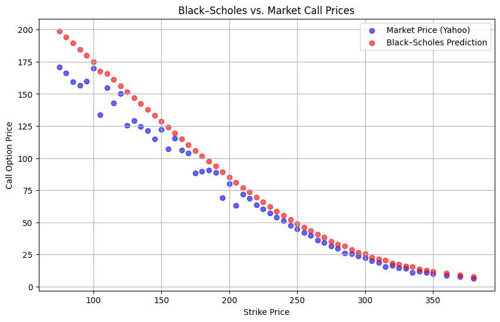

Finally to evaluate our model, we find the $R^2$ score between the predicted Black Scholes call price and the Yahoo Last price. The $R^2$ score was found to be 0.941, which is good.

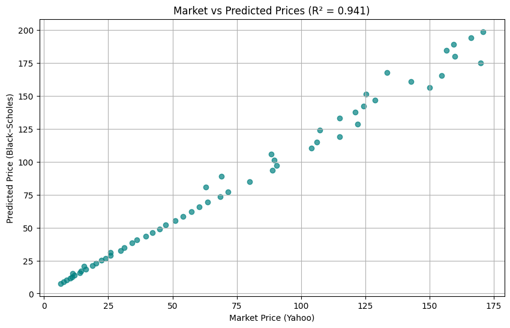


---


### Greeks (Sensitivities)

The Black-Scholes model also allows computation of the option Greeks, which are the sensitivities of the option price to various parameters:

| Greek | Financial Meaning                             | Mathematical Interpretation                      |
|-------|----------------------------------------------|-------------------------------------------------|
| Delta ($\Delta$) | Sensitivity of option price to underlying price changes | $\frac{\partial C}{\partial S}$               |
| Gamma ($\Gamma$) | Rate of change of Delta w.r.t underlying price          | $\frac{\partial^2 C}{\partial S^2}$            |
| Theta ($\Theta$) | Sensitivity to time decay                                   | $\frac{\partial C}{\partial t}$                |
| Vega | Sensitivity to volatility changes                 | $\frac{\partial C}{\partial \sigma}$           |
| Rho | Sensitivity to interest rate changes                 | $\frac{\partial C}{\partial r}$                 |

---

### Limitations

- Only applicable to European options (no early exercise).
- Assumes constant volatility and interest rates, which may not hold in practice.
- Assumes log-normal price distribution.
- Ignores dividends (though extensions exist).

---


## 2. Binomial Options Pricing Model

### Overview

The Binomial Options Pricing Model, introduced by Cox, Ross, and Rubinstein (1979), is a discrete-time approach for option valuation. It constructs a binomial price tree to model the possible paths an underlying asset price can take over the life of an option, enabling valuation of both European and American options.

---

### Advantages

- Suitable for **American options** where early exercise is possible.
- Models the price of the underlying asset as a recombining binomial tree, with up and down moves in each discrete time step.
- Flexible enough to handle dividends, varying volatility, and other features that the Black-Scholes model cannot.
- Can approximate the Black-Scholes price as the number of time steps increases.

---

### Model Construction

#### Price Tree

- Divide the option's life $T$ into $n$ discrete time intervals of length:


$\Delta t = \frac{T}{n}$


- At each step:

$
\begin{cases}
\text{Price moves up by a factor } u = e^{\sigma \sqrt{\Delta t}} \\
\text{Price moves down by a factor } d = e^{-\sigma \sqrt{\Delta t}} = \frac{1}{u}
\end{cases}
$

This ensures the tree recombines.

#### Risk-Neutral Probability

The risk-neutral probability $p$ of an up-move is calculated as:

$
p = \frac{e^{r \Delta t} - d}{u - d}
$

Here:

- $r$ = risk-free interest rate  
- $p$ is not an actual probability but a tool that adjusts expected payoffs so their discounted expected value equals the current option price (no arbitrage condition).

---

### Valuation Process: Backward Induction

1. **Calculate Terminal Payoffs**

At maturity (final nodes), the option payoff is:

- Call option payoff: $\max(S_n - K, 0)$
- Put option payoff: $\max(K - S_n, 0)$

Where $S_n = S_0 \times u^j \times d^{n-j}$, with j up-moves out of n.

2. **Step Back Through the Tree**

For each preceding node i, calculate option value as the discounted expected value under risk-neutral probabilities:

$
C_{i,j} = e^{-r \Delta t} \left[p C_{i+1,j+1} + (1-p) C_{i+1,j}\right]
$

3. **Adjust for Early Exercise (American Options)**

If pricing American options, at each node compare the *intrinsic value* (exercise immediately) with the *continuation value* (holding the option):

$
C_{i,j} = \max \left( \text{intrinsic value}, \ e^{-r \Delta t}[p C_{i+1,j+1} + (1-p) C_{i+1,j}] \right)
$

---

### Implementation

We built a function that translates the the Binomial Option pricer to process throught the dataset. The function is as follows:

```
def binomial_call_price(S, K, T, r, sigma, n=100):
    """
    Compute the European call option price using the Cox-Ross-Rubinstein model.
    """
    dt = T / n
    u = np.exp(sigma * np.sqrt(dt))
    d = 1 / u
    p = (np.exp(r * dt) - d) / (u - d)
    
    # Terminal prices
    ST = S * d**np.arange(n, -1, -1) * u**np.arange(0, n+1)
    payoff = np.maximum(ST - K, 0)
    
    # Backward induction
    for i in range(n-1, -1, -1):
        payoff = np.exp(-r * dt) * (p * payoff[1:] + (1 - p) * payoff[:-1])
    
    return payoff[0]
```

For simpler comparison, we have used the European call options data. We finally extract the whole data as a csv file including the predicted Call price.


---


### Advantages and Use Cases

- Straightforward and intuitive approach.
- Handles American exercise features easily.
- Can incorporate dividends and complex conditions.
- Converges to Black-Scholes price as number of steps $n \to \infty$.

---

### Limitations

- Computationally intensive for very large n, though efficient algorithms exist.
- Less elegant analytical solution compared to Black-Scholes.
- More numerical than closed-form.

---

## Summary Comparison

| Feature                      | Black-Scholes Model               | Binomial Options Pricing Model     |
|------------------------------|---------------------------------|-----------------------------------|
| Approach                     | Continuous-time, analytical PDE | Discrete-time, numerical tree     |
| Solution Type                | Closed-form formula              | Numerical iterative procedure     |
| Option Types                 | European only                   | European and American             |
| Dividends Treatment          | No (extensions exist)            | Easily included                   |
| Complexity                  | Requires understanding of stochastic calculus | Conceptually simpler, intuitive  |
| Computational Efficiency     | Very efficient                   | Computationally heavier for large steps |
| Adaptability                | Less flexible                    | Highly flexible                   |

---


# 4. Deep RL Trading Agent (DQTN)

This project implements a sophisticated stock trading agent using **Deep Reinforcement Learning (DRL)** combined with a **Transformer Neural Network** architecture. The goal is to train an agent that can learn optimal trading policies (Buy, Sell, Hold) by interacting with a simulated stock market environment.

---

## Deep Reinforcement Learning (DRL)

DRL is the backbone of this project, blending classical Reinforcement Learning (RL) with deep neural networks to allow the agent to learn from raw, high-dimensional market data.

### A. The RL Framework

The agent learns through the fundamental RL loop: **State $\rightarrow$ Action $\rightarrow$ New State, Reward**.

| Component | Role in the System |
| :--- | :--- |
| **Agent** (`Agent` class) | The decision-maker, containing the DQTN (the brain). |
| **Environment** (`Env` class) | Simulates the stock market, handling time, price changes, and portfolio value. |
| **State** | The input to the agent: a **normalized time-series** of prices (e.g., 364 days look-back window) from the `Stock` class. |
| **Action Space** | **Buy (1)**, **Sell (0)**, or **Hold (0)** (depending on the current position). |
| **Reward** | The feedback signal, calculated as the **logarithmic return** of the portfolio, adjusted by the trading **`Fee`**. Maximizing cumulative reward is the objective. |

### B. Deep Q-Networks (DQN)

The agent uses the DQN algorithm, a crucial technique for training DRL agents with discrete actions. 

[Image of Deep Q-Network Architecture]


* **Q-Value:** The predicted maximum cumulative future reward expected from taking a specific action $a$ in a state $s$, denoted as $Q(s, a)$.
* **Policy Network (`policy_net`):** The network that estimates the $Q(s, a)$ values and is used to select the action with the highest estimated return.
* **Target Network (`target_net`):** A stable, periodically updated copy of the policy network. It is used to calculate the stable future expected reward (the *target* Q-value) in the Bellman equation, minimizing learning instability.

### C. Exploration vs. Exploitation ($\epsilon$-Greedy)

During training, the agent uses the **$\epsilon$-greedy strategy** to balance trying new things (exploration) and using what it has learned (exploitation).

* **Exploration:** With probability $\epsilon$ (starting high), the agent chooses a random action.
* **Exploitation:** With probability $1-\epsilon$, the agent chooses the best action according to its learned policy.
* **Decay:** The $\epsilon$ value gradually decreases (`epsilon_decay`), causing the agent to rely less on randomness and more on its trained policy over time.

---

## Transformer Networks (DQTN)

The **Transformer** is integrated into the Q-Network (`DQTN`) because stock data is inherently a **time sequence**.

### A. Sequence Processing Power

The Transformer, known for its success in sequence tasks (like NLP), processes the entire input state (the 364-day price window) simultaneously using **Self-Attention**. This allows it to:

* Capture **long-range dependencies** (relationships between old and recent prices) efficiently.
* Dynamically assign **attention/importance** to specific time points within the input sequence, allowing the model to focus on the most relevant market moves for the current trade decision.

### B. State Preparation

The sequential nature of the input requires special preparation before feeding it to the Transformer:

1.  **Normalization:** Price data is scaled to a small, consistent range (e.g., $0$ to $1$) for optimal neural network training.
2.  **Positional Encoding:** Since the Transformer processes the entire sequence at once, **Positional Encoding** is added to the data to explicitly restore the chronological order (the time dimension) that the network would otherwise lose.

---
<!-- 
## Project Structure and Execution

The project follows a standard structure for DRL applications, separating the agent, environment, and data handling logic.

### A. Directory Tree -->


### B. Core Execution Flow

1.  **Data Preparation:** `create_test.py` downloads historical price data from **Yahoo Finance**, applies the required look-back window and normalization, and pickles the `Stock` objects into the `data/test` directory.
2.  **Training:** `main.py` initializes the `Agent`, fills the **`ReplayMemory`** (a circular buffer used to store and randomly sample experiences, stabilizing the learning process), and executes the `agent.train()` loop.
3.  **Testing/Evaluation:** `test.py` loads the saved `policy_net` weights and runs the agent through the test data (unseen by the model during training). The **`Env.render()`** function generates visualizations (stock price vs. trade actions) to inspect the agent's strategy.

### C. Performance Visualization

The visualization generated during testing provides the final verdict on the agent's generalization ability.

* The **Price Chart** plots the stock price with **Green ($\triangle$)** markers for Buys and **Red ($\nabla$)** markers for Sells.
* The **Cumulative Return** chart tracks the portfolio's multiplier over time.
    * **$1.0$** is the break-even line.
    * A final return **$> 1.0$** indicates a profitable strategy.
    * A final return **$< 1.0$** indicates a loss during the test period.


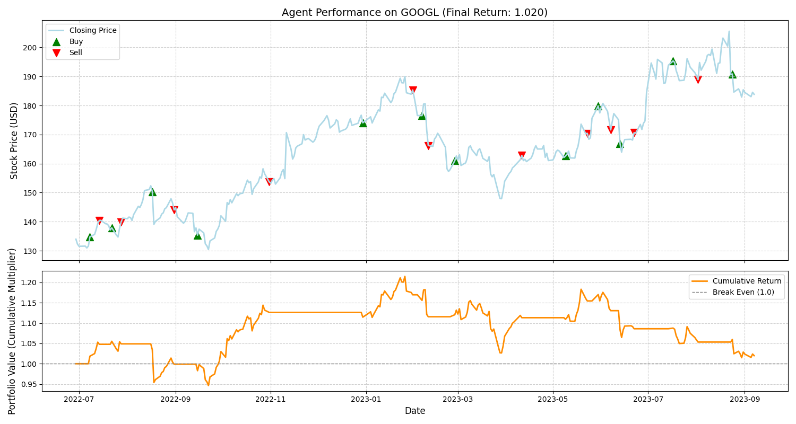


    

Training Status
-------------------

The agent completed 100 training episodes, reaching a stage of stable optimization before testing began.

<!-- **MetricFinal Value (Ep: 101)TrendAverage Loss**$0.000$Stable and minimal.**Average Performance (Multiplier)**$1.053$Net profitable performance during training episodes.**Learning Rate (Lr)**$3.49 \\times 10^{-5}$Low, suggesting fine-tuning phase by the StepLR scheduler.**Epsilon ($\\epsilon$)**$0.005$Minimal exploration, indicating the agent is primarily exploiting its learned policy. -->


Ep: 100, Reward: 0.3184, Reward (avg): 0.0024, Performance: 1.439, Performance (avg): 1.036, Lr: 3.49e-05, Loss: 0.0002, Loss (avg) 0.000, Epsilon: 0.005


Performance Visualization
------------------------------

The visualization generated during testing provides the final verdict on the agent's generalization ability across unseen data (out-of-sample).

*   The **Price Chart** plots the stock price with **Green ($\\triangle$)** markers for Buys and **Red ($\\nabla$)** markers for Sells.
    
*   The **Cumulative Return** chart tracks the portfolio's multiplier over time.
    
    *   **$1.0$** is the break-even line.
        
    *   A final return **$> 1.0$** indicates a profitable strategy.
        
    *   A final return **$< 1.0$** indicates a loss during the test period.
        

### A. Test Run 1: Sub-Optimal Performance (Final Return: 0.785)


#### 🔍 Inference

**ObservationConclusionFinal Return$0.785$** (Loss of **$21.5\\%$**)**Portfolio Value**Cumulative Return line is flat and consistently below $1.0$.**Trading Activity**Sparse trades, with few Buy ($\\triangle$) or Sell ($\\nabla$) markers.

### B. Test Run 2: Successful Generalization (Final Return: 1.020)

This chart demonstrates the agent successfully executing a profitable strategy in a different test environment.

#### 🔍 Inference

**ObservationConclusionFinal Return$1.020$** (Profit of **$2.0\\%$**)**Portfolio Value**The Cumulative Return shows a strong increase in value, peaking around $1.20$, before a slight retracement.**Trading ActivityFrequent trades**, with Buy ($\\triangle$) often preceding price rallies and Sell ($\\nabla$) occurring near subsequent local peaks.

IV. Summary and Future Work
---------------------------

The DQTN demonstrates **inconsistent generalization**, performing well in one test environment (Final Return $1.020$) but failing to adapt to another ($0.785$). This suggests the policy is not sufficiently robust to handle all out-of-sample market conditions.

### Future Improvements

*   **Robustness Training:** Implement **Averaged DQN** or **Ensemble Methods** to stabilize Q-value estimation and prevent policy collapse.
    
*   **Experience Replay Prioritization:** Introduce **Prioritized Experience Replay (PER)** to focus learning on unexpected or high-error state transitions, which are crucial for generalization.
    
*   **Risk Metric Reward:** Integrate a risk-adjusted metric (like the Sharpe Ratio) into the reward function to encourage smoother equity curves and discourage large drawdowns.


# 5. Hybrid GARCH + LSTM Model for Stock Market Prediction

<!-- **Author:** Vijay Krishna Sundaran Saravanan  
**BU ID:** U63589838  
**Developed Using:** Python (PyTorch, ARCH, TA-Lib) in VS Code Jupyter Notebook   -->

---

## Project Overview

This project builds a **hybrid AI-based trading framework** that combines statistical volatility modeling (**GARCH**) with deep learning (**LSTM**) to predict stock market movements and generate algorithmic trading signals.  

The model focuses on **Apple (AAPL)** stock from the NASDAQ dataset (1980–2022).  
It forecasts daily returns and assesses market volatility, enabling **risk-aware trading decisions**.

---

## Dataset

**Source:** [Kaggle – Stock Market Data (Paul Timothy Mooney)](https://www.kaggle.com/datasets/paultimothymooney/stock-market-data)  
**Folder Used:** NASDAQ → `AAPL.csv`  
**Date Range:** 1980-12-12 → 2022-12-12  
**Rows:** 10,590  
**Columns:** Date, Open, High, Low, Close, Volume, Adjusted Close  

---

## Project Pipeline

### 1. Data Preprocessing

- Converted the `Date` column to datetime format.  
- Checked for missing or duplicate values.  
- Sorted by date and ensured data continuity.  
- Displayed dataset information, shape, and descriptive statistics.  
- Visualized AAPL’s historical behavior.

#### Visualizations:
- **AAPL Closing Price Over Time**


- **Trading Volume Over Time**


- **Close Price Distribution**


---

### 2. Feature Engineering

Created new financial indicators and technical signals to enrich the dataset:  
- **Log Returns** – daily percentage change of adjusted close.  
- **RSI (Relative Strength Index)** – momentum indicator for overbought/oversold conditions.  
- **MACD & Signal Line** – identifies trend direction and strength.  
- **EMA 20 & EMA 50** – short- and long-term exponential moving averages.  
- **Rolling Volatility (20-day)** – captures short-term volatility changes.  

#### Visualizations:

- **Log Returns Over Time**


- **RSI (Overbought / Oversold Levels)**


- **MACD & Signal Line**


- **EMA Indicators (20 & 50)**


- **Rolling Volatility (20-day)**


- **Feature Correlation Heatmap**


---

### 3. GARCH(1,1) Modeling

A **GARCH (Generalized Autoregressive Conditional Heteroskedasticity)** model was applied to log returns using the `arch` package.

#### Purpose:
To model **time-varying volatility**, representing how market risk evolves over time.

#### Key Parameters:
| Parameter | Description |
|------------|--------------|
| ω (omega) | Long-term average variance |
| α (alpha) | Reaction to recent volatility shocks |
| β (beta) | Persistence of volatility over time |

Two new columns were created:
- `GARCH_Volatility` (daily standard deviation)  
- `GARCH_AnnVol` (annualized volatility)  

#### Visualization:
- **GARCH Conditional Volatility vs Rolling Volatility**


---

### 4. LSTM Deep Learning Model 

The **LSTM** (Long Short-Term Memory) model learns sequential patterns from time-series data to predict the **next-day log return**.

**Input:** 60-day rolling window of 9 selected features (including GARCH outputs)

#### Model Architecture:
- 2 LSTM layers (128 hidden units each)  
- Fully connected layers (ReLU activation, Dropout=0.2)  
- Output: single value (predicted next-day return)  

| Component | Configuration |
|------------|---------------|
| Loss Function | Mean Squared Error (MSE) |
| Optimizer | Adam |
| Learning Rate | 0.001 |
| Epochs | 25 |
| Batch Size | 32 |
| Parameters | 207,425 |
| Device | CPU |

---

### 5. Evaluation

After training, model predictions were compared to actual test data.

#### Evaluation Metrics:
| Metric | Value |
|--------:|-------:|
| MSE | 0.000339 |
| RMSE | 0.0184 |
| R² | -0.0119 |
| Correlation | 0.013 |

#### Visualization:
- **Model Predictions vs Actual Returns**


---

### 6. Trading Simulation

A simple trading logic was applied:

| Condition | Action |
|------------|---------|
| Predicted Return > 0 | BUY |
| Predicted Return < 0 | SELL |
| Else | HOLD |

<!-- Users can input any date (1981–2022) to test predicted vs actual movement. -->

<!-- #### Example:

**Date:** 2022-11-30  
**Predicted Change:** -0.11%  
**Actual Change:** +0.19%  
**Suggested Action:** SELL   -->

---

## Visual Summary

1. **AAPL Closing Price Over Time** – long-term growth visualization.  
2. **RSI, MACD, EMA Indicators** – signal momentum and market trends.  
3. **Rolling & GARCH Volatility** – reflect market risk dynamics.  
4. **LSTM Predictions vs Actual Returns** – demonstrate model learning.  


<!-- ---

## Technologies Used

**Language:** Python  

**Libraries:**
- `pandas`, `numpy`, `matplotlib`, `seaborn`  
- `ta` (technical analysis indicators)  
- `arch` (volatility modeling)  
- `torch` (PyTorch deep learning)  
- `scikit-learn` (scaling and metrics)  
- `plotly` (interactive visualization)

--- -->

## Concept Summary

| Component | Role |
|------------|------|
| **GARCH(1,1)** | Models dynamic volatility and market risk |
| **LSTM** | Learns time-dependent patterns from price data |
| **Hybrid Model** | Combines GARCH’s volatility awareness with LSTM’s trend prediction |

This hybrid design bridges **financial econometrics** and **deep learning**, allowing the system to better adapt to real-world market behavior.


---

## Summary

- Built a complete **hybrid GARCH + LSTM** pipeline integrating both statistical and neural models.  
- Implemented every stage — from **data preprocessing** to **trading signal generation**.  
- Demonstrated a realistic simulation of automated trading logic.  


# Future Work
- **Automated Trading System:**  
  Extend this project into a live **paper trading bot** using the **Alpaca API**, enabling real-time execution of trades based on Transformer model predictions.

- **Performance Optimization:**  
  Implement continuous model retraining and adaptive learning to adjust to evolving market conditions and improve trading decision accuracy.

- **End-to-End Trading Pipeline:**  
  Develop a full pipeline integrating **data ingestion**, **signal generation**, **risk management**, and **portfolio evaluation**, ultimately transitioning from paper trading to a deployable automated trading strategy.


# 6. PatchTST Algorithmic Trading System  
*A Deep Learning–Powered Trading Bot Using PatchTST + Alpaca Paper Trading*

This repository contains a **full end-to-end algorithmic trading pipeline**, from  
historical data ingestion → feature engineering → deep-learning prediction → automated order execution through **Alpaca’s Paper Trading API**.

The system leverages **PatchTST**, a state-of-the-art Transformer model designed specifically for long-horizon time-series forecasting.

---

# Features

✔ Fully automated data ingestion from Alpaca’s IEX feed  
✔ Technical indicator engineering (SMA, EMA, RSI, ATR, Volatility)  
✔ PatchTST deep learning architecture for next-day return forecasting  
✔ Clean training pipeline with scaling + sequences  
✔ Trade execution via Alpaca *with bracket orders*  
✔ Dry-run mode for safe testing  
✔ Production-ready trading bot (`patchtst_alpaca_bot.py`)  
✔ Detailed documentation and reproducible notebook  

---

# System Architecture

The system contains four major layers:

## **1. Data Layer**
- Uses Alpaca’s Historical Market Data (IEX).
- Downloads up to 10 years of OHLCV data.
- Adds technical indicators:
  - SMA10 / SMA50
  - EMA12 / EMA26
  - RSI14
  - ATR14
  - Volatility (20-day std)
  - Close/SMA ratios

Ensures exact match between training-time and live-time features.

---

## **2. Model Layer (PatchTST)**

PatchTST is a Transformer architecture optimized for time-series tasks.

### Model Highlights:
- Sequence length: **84 days**
- Patch length: **7 days**
- Model dimension: **128**
- Multi-head attention: **8 heads**
- Transformer layers: **4**
- Output: **1-step ahead predicted return**

### Why PatchTST?
- Reduces sequence complexity by patching  
- Captures both short and long-term dependencies  
- More efficient and accurate than LSTM, GRU, or vanilla Transformers  
- Proven strong on financial datasets  

---

## **3. Training Pipeline**

### Steps:
1. Normalize all features with `StandardScaler`  
2. Convert time-series into (84 × 12) sequences  
3. Split dataset:
   - 80% training  
   - 10% validation  
   - 10% testing  
4. Train PatchTST using:
   - **Loss:** MSE  
   - **Optimizer:** Adam  
   - **Batch size:** 64  

### Model Checkpoint Includes:
- Model weights  
- Feature columns  
- Trained scaler  
- Sequence length & patch length configuration  

---

## **4. Trading Layer (Live Bot)**

### Trading Flow:
```
Live Alpaca Data → Indicators → Scaler → PatchTST → Prediction → Signal → Order
```

### Signal Logic:
- BUY if prediction is in **top 25% quantile**
- Only BUY if RSI < 70 (avoid overbought conditions)
- Max exposure: **1 active position**
- SELL positions that drop below threshold

### Position Sizing:
```
Position = (Equity × 0.25) ÷ Last Close Price
```

### Order Type:
- Market BUY  
- Stop-loss at **−3%**  
- Take-profit at **+6%**

All executed as a **bracket order**.

### Dry Run Mode:
- `DRY_RUN = True` → bot only prints simulated trades  
- `DRY_RUN = False` → executes real paper trades  

---

# 🔄 Data Flow Diagram

```
                ┌────────────────────┐
                │  Alpaca IEX Data   │
                └─────────┬──────────┘
                          │
                          ▼
               ┌──────────────────────┐
               │ Feature Engineering  │
               └─────────┬────────────┘
                         │
                         ▼
           ┌────────────────────────────┐
           │ PatchTST Model Prediction  │
           └───────────┬────────────────┘
                       │
                       ▼
            ┌─────────────────────────┐
            │  Trading Signal Engine  │
            └──────────┬──────────────┘
                       │
                       ▼
             ┌────────────────────────┐
             │ Alpaca Order Executor │
             └────────────────────────┘
```

---

# 📂 Project Structure

```
project/
│── models/
│   └── patchtst_final.pth
│── keys/
│   └── alpaca_keys.txt
│── training_notebook.ipynb
│── patchtst_alpaca_bot.py
│── README.md
```

---

# ⚙️ Installation & Setup

## 1. Install Dependencies
```bash
pip install torch pandas numpy alpaca-trade-api matplotlib scikit-learn yfinance
```

## 2. Add Alpaca Keys
Create:

```
keys/alpaca_keys.txt
```

Inside:
```
APCA_API_KEY_ID=YOUR_KEY
APCA_API_SECRET_KEY=YOUR_SECRET
```

## 3. Train Model
Open:

```
training_notebook.ipynb
```

Train PatchTST and it will generate:

```
models/patchtst_final.pth
```

## 4. Run Trading Bot
```bash
python3 patchtst_alpaca_bot.py
```

Disable dry mode for actual paper trades:
```python
DRY_RUN = False
```

---

# 📊 Example Outputs

### Predictions
```
AAPL → 0.0050
MSFT → 0.0096
AMZN → 0.0121
GOOG → 0.0166
```

### Trading Signals
```
{'AAPL': 0, 'MSFT': 0, 'AMZN': 0, 'GOOG': 1}
```

### Executed Order (Paper Trading)
- Market Buy: **31 shares of GOOG**
- Stop-loss: **$311.25**
- Take-profit: **$340.13**


---

# 🛠 Future Enhancements

- 🔁 Automatic weekly retraining  
- 📈 Integrated backtesting  
- 🧠 Multi-timeframe PatchTST (daily + hourly)  
- 🧮 Portfolio optimization  
- 📤 Telegram/Discord alerts  
- 🖥 Web dashboard for live monitoring  

---

# 🏁 Conclusion

This project delivers a **modern, data-driven trading platform** with:

- Strong deep-learning forecasting  
- A clean data → model → trading workflow  
- Realistic execution through Alpaca's paper trading  
- A scalable architecture suitable for professional quant development  

---
